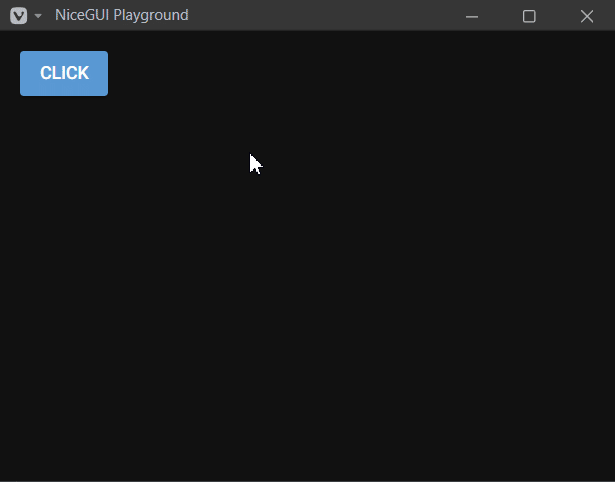

This post is inspired by a [reddit thread](https://old.reddit.com/r/nicegui/comments/18d0gmj/i_made_a_question_popup_with_two_buttons_i_wanted/) I responded to a while back.

Here's a more generic version of the answer I gave: 

```py
class ConfirmationPopup(ui.dialog):
    def __init__(self):
        super().__init__()
        with self, ui.card():
            ui.label('Are you sure you want to do that?')
            with ui.row():
                ui.button('Yes', on_click=lambda: self.submit(True))
                ui.button('No', on_click=lambda: self.submit(False))

async def click():
    result = await ConfirmationPopup()
    if result == True:
        ui.notify('User clicked Yes!')
    if result == False:
        ui.notify('User clicked No!')
    if result is None:
        ui.notify('User clicked outside the dialog!')

ui.button("Click", on_click=click)
ui.run()
```



What's interesting here is that you can `await` a dialog box, and the yielded value is the "conclusion" of the dialog interaction. 

This behavior is caused by `ui.dialog.__await__` ([source code](https://github.com/zauberzeug/nicegui/blob/main/nicegui/elements/dialog.py#L41)), and reproduced here:

```py
def __await__(self):
    self._result = None
    self.submitted.clear()
    self.open()
    yield from self.submitted.wait().__await__()  # pylint: disable=no-member
    result = self._result
    self.close()
    return result
```

This method allows you await an instance of `ui.dialog`, which will open the dialog, wait and collect anything sent into `self.submit()` from inside the dialog class, and then return that value to the calling code.

`await`ing the dialog does require writing an `async` function, but luckily all nicegui objects that accept callbacks are perfectly happy to accept an `async` callback, which helps contain the infectious spread of [function colors](https://journal.stuffwithstuff.com/2015/02/01/what-color-is-your-function/), if that's something you have opinions about.

Hopefully these examples help you organize your NiceGUI code!  